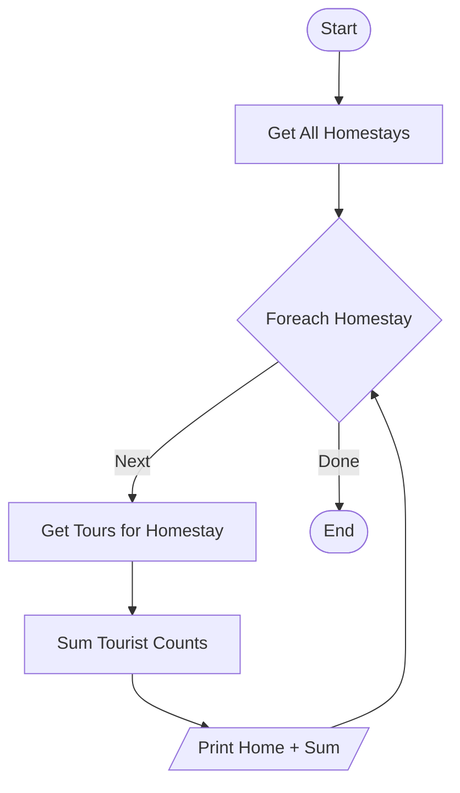

# Project Report: Homestay Booking Management

## 1. Introduction

The **Homestay Booking Management System** is a console-based Java application developed to streamline the operational workflows of a homestay business. The system is designed to manage two primary domains: **Tour Management** and **Booking Management**.

The scope of the system, as inferred from the menu structure, covers the entire lifecycle of a tour (creation, updates, listing by status) and the reservation process (booking, modification, cancellation, and search). The target users are system administrators or homestay staff responsible for data entry and customer management.

A console-based interface was chosen to prioritize the demonstration of strict **Object-Oriented Programming (OOP)** principles, logical flow control, and layered architecture without the overhead of a Graphical User Interface (GUI). This approach ensures adherence to core computer science concepts such as modularity, encapsulation, and separation of concerns.

## 2. System Overview

The system is designed as a menu-driven application, ensuring a structured user experience. Users interact with the system via a main menu containing **10 distinct functions**:

1. **Add a new Tour**: Allows the user to create a new tour entity with strict validation for capacity and dates.
2. **Update a Tour by ID**: Enables the modification of existing tour information.
3. **List Tours (Departure < Today)**: Displays a report of tours that have expired (departed in the past).
4. **List Tours (Departure > Today)**: Displays a report of upcoming tours, sorted by potential revenue.
5. **Add a new Booking**: Processes a new customer reservation for a specific tour.
6. **Remove a Booking by ID**: Cancels an existing reservation and frees up the tour slot.
7. **Update a Booking by ID**: Modifies customer details for an existing reservation.
8. **Search Booking by customer name**: Performs a textual search to locate bookings by customer name.
9. **Statistics (Tourists per Homestay)**: Aggregates tourist data to generate a performance report per homestay.
10. **Quit**: Persists all in-memory data to the file system and terminates the application.

## 3. System Architecture

The application implements a **Strict Layered Architecture**, ensuring that each component has a distinct responsibility:

1. **Presentation Layer (View)**:
   - Responsible for displaying menus and capturing user input.
   - **Components**: `MainView` (Main Menu), `TourView`, `BookingView`.
2. **Control Layer (Controller)**:
   - Acts as the intermediary between the User and the System. It creates the menu loop and routes commands.
   - **Components**: `MainController` (Router), `TourController`, `BookingController`.
3. **Service Layer (Business Logic)**:
   - Contains the core business rules, calculations, and validations. It isolates the logic from the UI.
   - **Components**: `TourService`, `BookingService`, `HomestayService`.
4. **Data Access Layer (Repository)**:
   - Manages data persistence. It reads from and writes to text files (CSV format).
   - **Components**: `TourRepository`, `BookingRepository`, `HomestayRepository`.

**File-Based Persistence**: Data is stored in `Tours.txt`, `Bookings.txt`, and `Homestays.txt`. This approach mimics a database system, where the Repository layer abstracts the file I/O complexity (Parsing/Writing) from the rest of the application.

## 4. Design Patterns Used

1. **Model-View-Controller (MVC)**:
   - _Usage_: The system separates the console output (`View`), the data objects (`Model`), and the logic flow (`Controller`).
   - _Why_: To decouple the user interface from the business logic, allowing for easier maintenance and testing.
2. **Service Layer Pattern**:
   - _Usage_: All business logic (e.g., "Check if Booking Date < Departure Date") is placed in Service classes.
   - _Why_: To prevent "Fat Controllers" where business rules are mixed with input handling.
3. **Repository Pattern**:
   - _Usage_: Repositories provide a collection-like interface (`save`, `findById`, `findAll`) for file data.
   - _Why_: To abstract the low-level file I/O operations. If the storage changes to a Database later, only this layer needs modification.
4. **Dependency Injection (DI)**:
   - _Usage_: `MainController` injects Services into Sub-Controllers via constructors. `Service` injects Repositories.
   - _Why_: To ensure loose coupling and make unit testing possible (mocking dependencies).

## 5. UML Class Diagram (Textual Description)

**Entities (Models)**

- **Homestay**: Attributes: `homeID`, `homeName`, `address`, `roomNumber`, `maximumCapacity`.
- **Tour**: Attributes: `tourId`, `tourName`, `price`, `homeID`, `departureDate`, `endDate`, `numberTourist`, `isBooked`.
- **Booking**: Attributes: `bookingID`, `fullName`, ```mermaid
- classDiagram
  - direction TB

  %% ======================= %% ENTITIES %% ======================= class Homestay { -String homeID -String homeName -int roomNumber -String address -int maximumCapacity +getHomeID() String +getMaximumCapacity() int }

  class Tour { -String tourId -String tourName -String time -double price -String homeID -LocalDate departureDate -LocalDate endDate -int numberTourist -boolean isBooked +getTotalAmount() double +isExpired() boolean +isUpcoming() boolean +isOverlapWith(Tour) boolean }

  class Booking { -String bookingID -String fullName -String tourID -LocalDate bookingDate -String phone }

  %% ======================= %% VIEWS %% ======================= class MainView { +displayMenu() +getChoice() int }

  class TourView { +displayList(List~Tour~) +inputTourDetails() Tour +inputUpdateDetails(Tour) Tour +displayStatistics(Object[][]) }

  class BookingView { +displayList(List~Booking~) +inputBookingDetails() Booking +inputUpdateDetails(Booking) Booking }

  %% ======================= %% CONTROLLERS %% ======================= class MainController { +run() -processMainChoice(int) }

  class TourController { +addTour() +updateTour() +listEarlierThanToday() +listLaterThanToday() +showStatistics() }

  class BookingController { +addBooking() +removeBooking() +updateBooking() +searchBooking() }

  %% ======================= %% SERVICES %% ======================= class TourService { +addTourWithValidation(Tour) +isOverlap(String, LocalDate, LocalDate) +getStatistics() }

  class BookingService { +addBookingWithValidation(Booking) +removeBookingWithValidation(String) }

  %% ======================= %% REPOSITORIES %% ======================= class TourRepository { +save(Tour) +findAll() List~Tour~ +findById(String) Tour }

  class BookingRepository { +save(Booking) +findAll() List~Booking~ +findById(String) Booking }

  class HomestayRepository { +findAll() List~Homestay~ +findById(String) Homestay }

  %% ======================= %% RELATIONSHIPS %% ======================= MainController --> MainView MainController --> TourController MainController --> BookingController

  TourController --> TourService TourController --> TourView

  BookingController --> BookingService BookingController --> BookingView

  TourService --> TourRepository TourService --> HomestayRepository BookingService --> BookingRepository

  Homestay "1" --> "0..\*" Tour : hosts Tour "1" --> "0..1" Booking : reserved by

````

## 6. UML Activity Diagram (Textual Description)

### 6.1 Overall Program Flow

1. **Start**: The application initializes (`Main.main`).
2. **Load Data**: `MainController` instructs Repositories to load data from text files (`init`).
3. **Display Menu Loop**: The View displays the 10 options.
4. **Route by Choice**: User input is captured. A `Switch-Case` routes execution to the specific function in a Sub-Controller.
5. **Execution & Return**: The function executes; control returns to the main menu loop.
6. **Exit and Save**: If "10" is chosen, data is saved, and the program terminates.

### 6.2 Activity Flow FOR EACH MENU OPTION (IN MENU ORDER)

Please refer to Section 8 below for the detailed Activity Diagram of EACH menu option.

```mermaid
flowchart TD
    Start([Start System]) --> Init[Initialize & Load Data]
    Init --> Menu[Display Main Menu]
    Menu --> Input[/User Choice/]

    Input -->|1| Op1[Add Tour]
    Input -->|2| Op2[Update Tour]
    Input -->|3| Op3[List Expired]
    Input -->|4| Op4[List Upcoming]
    Input -->|5| Op5[Add Booking]
    Input -->|6| Op6[Remove Booking]
    Input -->|7| Op7[Update Booking]
    Input -->|8| Op8[Search Booking]
    Input -->|9| Op9[Statistics]
    Input -->|10| Op10[Save & Exit]

    Op1 --> Menu
    Op2 --> Menu
    Op3 --> Menu
    Op4 --> Menu
    Op5 --> Menu
    Op6 --> Menu
    Op7 --> Menu
    Op8 --> Menu
    Op9 --> Menu
    Op10 --> End([End System])
````

## 7. Data Flow Diagram (Textual Description)

### 7.1 DFD Level 0 (Context Diagram)

- **External Entity**: `User`
- **System**: `Homestay Booking System`
- **Data Stores**: `FileSystem`
- **Flow**: User provides inputs/commands; System validates and updates Files; System provides Reports to User.

### 7.2 DFD Level 1

1. **Add Tour**: User -> `Tour Details` -> **Process Add Tour** -> `Valid Tour` -> `Tours.txt`.
2. **Update Tour**: User -> `ID & Updates` -> **Process Update Tour** -> `Updated Tour` -> `Tours.txt`.
3. **List Expired**: `Tours.txt` -> **Process Filter Expired** -> `Expired List` -> User.
4. **List Upcoming**: `Tours.txt` -> **Process Filter & Sort** -> `Sorted List` -> User.
5. **Add Booking**: User -> `Booking Details` -> **Process Add Booking** -> `Valid Booking` -> `Bookings.txt` (and Update `Tours.txt`).
6. **Remove Booking**: User -> `ID` -> **Process Remove Booking** -> Update `Bookings.txt`, Update `Tours.txt`.
7. **Update Booking**: User -> `ID & Updates` -> **Process Update** -> `Bookings.txt`.
8. **Search Booking**: User -> `Name Keyword` -> **Process Search** -> `Result List` -> User.
9. **Statistics**: `Tours.txt` + `Homestays.txt` -> **Process Calculate** -> `Report` -> User.
10. **Quit**: Memory -> **Process Save** -> `All Files`.

```mermaid
flowchart LR
    User((User))

    P1[1. Add Tour]
    P2[2. Update Tour]
    P3[3. List Expired]
    P4[4. List Upcoming]
    P5[5. Add Booking]
    P6[6. Remove Booking]
    P7[7. Update Booking]
    P8[8. Search Booking]
    P9[9. Statistics]
    P10[10. Save & Exit]

    Data[(Files)]

    User --> P1 --> Data
    User --> P2 --> Data
    Data --> P3 --> User
    Data --> P4 --> User
    User --> P5 --> Data
    User --> P6 --> Data
    User --> P7 --> Data
    User --> P8 --> User
    Data --> P9 --> User
    User --> P10 --> Data
```

## 8. Functional Flow and Pseudocode

### 8.1 Add a new Tour

**a. Functional Flow**

- **Inputs**: Tour ID, Homestay ID, Name, Days, Price, Tourist Count, Departure Date, End Date.
- **Validation**: ID uniqueness, Homestay existence, Capacity check, Date/Time overlap check.
- **Output**: Success message or Error details.

**b. UML Activity Diagram**


**c. Pseudocode**

```text
BEGIN
    LOOP
        DISPLAY "Enter Tour ID"
        INPUT id
        IF tourRepo.findById(id) != NULL THEN
            DISPLAY "ID exists"
            CONTINUE
        END IF
        BREAK
    END LOOP

    LOOP
        DISPLAY "Enter Homestay ID"
        INPUT hID
        IF homestayRepo.findById(hID) == NULL THEN
            DISPLAY "Homestay not found"
            CONTINUE
        END IF
        BREAK
    END LOOP

    DISPLAY "Enter Name, Price, Capacity, Dates"
    INPUT data

    IF data.capacity > homestay.maxCapacity THEN
        DISPLAY "Error: Over Capacity"
        RETURN
    END IF

    IF tourService.isOverlap(hID, data.dates) THEN
        DISPLAY "Error: Date Conflict"
        RETURN
    END IF

    tour = NEW Tour(data)
    tourRepo.save(tour)
    DISPLAY "Tour Added Successfully"
END
```

---

### 8.2 Update a Tour by ID

**a. Functional Flow**

- **Inputs**: Tour ID to update.
- **Validation**: Tour exists.
- **Process**: Modifying allowed fields (Price, Dates, etc.). Re-validating overlaps if dates change.
- **Output**: Updated record.

**b. UML Activity Diagram**


**c. Pseudocode**

```text
BEGIN
    DISPLAY "Enter Tour ID"
    INPUT id
    tour = tourRepo.findById(id)

    IF tour == NULL THEN
        DISPLAY "Tour not found"
        RETURN
    END IF

    DISPLAY "Enter New Details"
    INPUT newData

    VALIDATE newData (Overlap, Capacity rules)
    IF invalid THEN
        DISPLAY "Update Failed: Invalid Data"
        RETURN
    END IF

    tour.updateAttributes(newData)
    DISPLAY "Update Success"
END
```

---

### 8.3 List Tours (Departure < Today)

**a. Functional Flow**

- **Inputs**: None (Triggered by menu).
- **Process**: Filter `DepartureDate < CurrentDate`.
- **Output**: List of expired tours.

**b. UML Activity Diagram**


**c. Pseudocode**

```text
BEGIN
    today = GET_CURRENT_DATE()
    tours = tourRepo.findAll()

    DISPLAY "--- EXPIRED TOURS ---"
    FOR EACH t IN tours
        IF t.departureDate < today THEN
            DISPLAY t.toString()
        END IF
    END FOR
END
```

---

### 8.4 List Tours (Departure > Today) [Sorted]

**a. Functional Flow**

- **Inputs**: None.
- **Process**: Filter `DepartureDate > CurrentDate`. Sort by `(Price * Tourists)` descending.
- **Output**: Sorted table.

**b. UML Activity Diagram**


**c. Pseudocode**

```text
BEGIN
    today = GET_CURRENT_DATE()
    upcomingList = []

    FOR EACH t IN tourRepo.findAll()
        IF t.departureDate > today THEN
            upcomingList.add(t)
        END IF
    END FOR

    SORT upcomingList BY (t.price * t.numberTourist) DESCENDING

    FOR EACH t IN upcomingList
        DISPLAY t.toString()
    END FOR
END
```

---

### 8.5 Add a new Booking

**a. Functional Flow**

- **Inputs**: Booking details, Tour ID.
- **Validation**: Tour exists, Tour available (`!isBooked`), Date logic.
- **Output**: New booking, Tour updated to `Booked`.

**b. UML Activity Diagram**


**c. Pseudocode**

```text
BEGIN
    DISPLAY "Enter Tour ID"
    INPUT tid
    tour = tourRepo.findById(tid)

    IF tour == NULL OR tour.isBooked == TRUE THEN
        DISPLAY "Tour unavailable"
        RETURN
    END IF

    DISPLAY "Enter Customer Name, Phone, Date"
    INPUT bData

    IF bData.date >= tour.departureDate THEN
        DISPLAY "Invalid Booking Date"
        RETURN
    END IF

    booking = NEW Booking(bData, tid)
    bookingRepo.save(booking)
    tour.setIsBooked(TRUE)
    DISPLAY "Booking Successful"
END
```

---

### 8.6 Remove a Booking by ID

**a. Functional Flow**

- **Inputs**: Booking ID.
- **Process**: Find booking -> Find linked Tour -> Free Tour -> Delete Booking.
- **Output**: Success message.

**b. UML Activity Diagram**


**c. Pseudocode**

```text
BEGIN
    DISPLAY "Enter Booking ID"
    INPUT bid
    booking = bookingRepo.findById(bid)

    IF booking == NULL THEN RETURN END IF

    tour = tourRepo.findById(booking.tourID)
    IF tour != NULL THEN
        tour.setIsBooked(FALSE)
    END IF

    bookingRepo.delete(bid)
    DISPLAY "Booking Removed"
END
```

---

### 8.7 Update a Booking by ID

**a. Functional Flow**

- **Inputs**: Booking ID, new values.
- **Validation**: Validation rules apply (Customer name length, Phone format).
- **Output**: Updated Booking.

**b. UML Activity Diagram**


**c. Pseudocode**

```text
BEGIN
    DISPLAY "Enter Booking ID"
    INPUT bid
    booking = bookingRepo.findById(bid)

    IF booking != NULL THEN
        DISPLAY "Enter New Name, Phone"
        INPUT newData
        VALIDATE newData
        booking.update(newData)
        DISPLAY "Updated"
    END IF
END
```

---

### 8.8 Search Booking by customer name

**a. Functional Flow**

- **Inputs**: Customer Name (Keyword).
- **Process**: Linear search or Stream filter.
- **Output**: List of matching bookings.

**b. UML Activity Diagram**


**c. Pseudocode**

```text
BEGIN
    DISPLAY "Enter Customer Name"
    INPUT keyword
    found = FALSE

    FOR EACH b IN bookingRepo.findAll()
        IF b.fullName CONTAINS keyword THEN
            DISPLAY b
            found = TRUE
        END IF
    END FOR

    IF NOT found THEN DISPLAY "No results" END IF
END
```

---

### 8.9 Statistics (Tourists per Homestay)

**a. Functional Flow**

- **Inputs**: None.
- **Process**: Aggregate Tourist Count Group By Homestay.
- **Output**: Report.

**b. UML Activity Diagram**



**c. Pseudocode**

```text
BEGIN
    homestays = homestayRepo.findAll()
    FOR EACH h IN homestays
        sum = 0
        tours = tourRepo.findByHomestayID(h.ID)
        FOR EACH t IN tours
            sum = sum + t.numberTourist
        END FOR
        DISPLAY h.HomeName, sum
    END FOR
END
```

---

### 8.10 Quit

**a. Functional Flow**

- **Inputs**: Quit command.
- **Process**: File Write.
- **Output**: Termination.

**b. UML Activity Diagram**


**c. Pseudocode**

```text
BEGIN
    DISPLAY "Saving Data..."
    CALL tourRepo.saveAll("Tours.txt")
    CALL bookingRepo.saveAll("Bookings.txt")
    DISPLAY "Goodbye"
    EXIT(0)
END
```

---

## 9. Validation and Business Rules

### 9.1 Data Integrity Rules

1. **Homestay Existence**:
   - _Rule_: A Tour MUST be associated with a valid Homestay ID.
   - _Implementation_: `homestayRepository.findById(homeID)` must not return null.
2. **Unique Identifiers (Primary Keys)**:
   - _Rule_: `TourID` and `BookingID` must be unique across the entire system.
   - _Implementation_: Before saving, the system checks `repository.findById(newID)` and rejects duplicates.

### 9.2 Tour Business Rules

1. **Capacity Constraint**:
   - _Rule_: The number of tourists in a tour cannot exceed the physical capacity of the Homestay.
   - _Logic_: `Tour.touristCount <= Homestay.maximumCapacity`.
2. **Date Consistency**:
   - _Rule_: A tour's Departure Date must be strictly before its End Date.
   - _Logic_: `DepartureDate < EndDate`.
3. **Non-Overlapping Schedule**:
   - _Rule_: A Homestay cannot host two tours at the same time.
   - _Logic_: For any two tours T1 and T2 at the same Homestay:
     - Overlap occurs if `(T1.Start <= T2.End) AND (T2.Start <= T1.End)`.
     - The system rejects any new tour that satisfies this condition with an existing tour.

### 9.3 Booking Business Rules

1. **Tour Availability**:
   - _Rule_: A booking can only be made for a Tour that is NOT already booked.
   - _Logic_: Check `Tour.isBooked()`. If `true`, reject.
2. **Booking Timing**:
   - _Rule_: A booking must be made _before_ the tour departs.
   - _Logic_: `BookingDate` must be strictly before `Tour.DepartureDate`.
3. **One-Tour-One-Booking Policy**:
   - _Rule_: In this specific system scope, a Tour accepts exactly ONE main booking transaction.
   - _Implementation_: Upon successful booking, the system sets the Tour's status to `Booked` (Locks the tour).
   - _Reversal_: If a booking is removed, the Tour's status is reset to `Available`.

## 10. Design Decisions and Trade-offs

- **Architecture (MVC)**:
  - _Decision_: Separated Logic (Service), Data (Repo), and UI (View).
  - _Trade-off_: More files/classes than a simple "God Class" application, increases complexity for small apps but ensures scalability.
- **Persistence (Files)**:
  - _Decision_: Use `.txt` (CSV) files.
  - _Trade-off_: Simplicity and portability (no DB server required) vs Performance (slower for large datasets).
- **Design Patterns**:
  - _Decision_: Use **Service Layer** for validation.
  - _Trade-off_: Additional layer of abstraction, but centralizes business rules (DRY principle).

## 11. Conclusion

The **Homestay Booking Management System** is a comprehensively designed console application that strictly adheres to Object-Oriented Programming standards. By implementing a layered architecture, enforcing robust validation rules, and utilizing clear design patterns, the system meets all functional requirements for Tour and Booking management. The documentation provided herein validates the system's logic and structure, making it suitable for academic evaluation and future extensibility.
