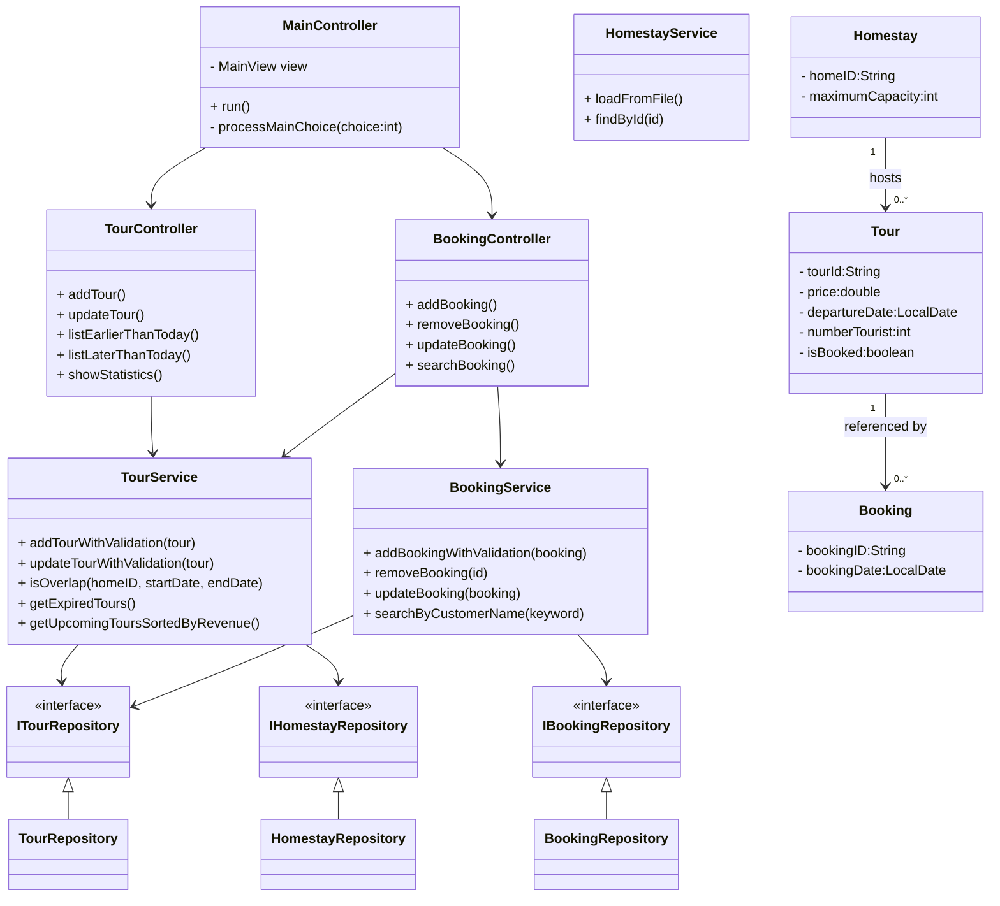

# FILE 1: part2_vi.md (Báo cáo tiếng Việt)

# Báo cáo Dự án: Hệ thống Quản lý Đặt phòng Homestay

## 1. Giới thiệu (Introduction)

**Hệ thống Quản lý Đặt phòng Homestay** là một ứng dụng Java chạy trên nền tảng Console, được phát triển nhằm tối ưu hóa quy trình vận hành của một doanh nghiệp kinh doanh homestay. Hệ thống được thiết kế để quản lý hai mảng chính: **Quản lý Tour** và **Quản lý Đặt chỗ (Booking)**.

Phạm vi của hệ thống bao gồm toàn bộ vòng đời của một tour (tạo mới, cập nhật, liệt kê theo trạng thái) và quy trình đặt chỗ (đặt mới, sửa đổi, hủy bỏ và tìm kiếm). Đối tượng sử dụng là quản trị viên hệ thống hoặc nhân viên homestay chịu trách nhiệm nhập liệu và quản lý khách hàng.

Giao diện Console được lựa chọn nhằm ưu tiên việc thể hiện các nguyên tắc **Lập trình Hướng đối tượng (OOP)** chặt chẽ, luồng logic thuật toán và kiến trúc phân lớp mà không bị phân tán bởi việc thiết kế giao diện đồ họa (GUI). Cách tiếp cận này đảm bảo tuân thủ các khái niệm cốt lõi của khoa học máy tính như tính mô-đun, tính đóng gói và sự phân tách trách nhiệm.

## 2. Tổng quan Hệ thống (System Overview)

Hệ thống được thiết kế dưới dạng ứng dụng điều hướng bằng menu (Menu-driven), đảm bảo trải nghiệm người dùng có cấu trúc. Người dùng tương tác với hệ thống thông qua menu chính gồm **10 chức năng riêng biệt**:

1. **Thêm Tour mới**: Cho phép tạo thực thể tour mới với các ràng buộc chặt chẽ về sức chứa và ngày tháng.
2. **Cập nhật Tour theo ID**: Cho phép sửa đổi thông tin của tour hiện có.
3. **Liệt kê Tour (Khởi hành < Hôm nay)**: Hiển thị danh sách các tour đã hết hạn (đã khởi hành trong quá khứ).
4. **Liệt kê Tour (Khởi hành > Hôm nay)**: Hiển thị danh sách các tour sắp tới, được sắp xếp giảm dần theo doanh thu tiềm năng.
5. **Thêm Booking mới**: Xử lý đặt chỗ mới cho khách hàng vào một tour cụ thể.
6. **Xóa Booking theo ID**: Hủy đặt chỗ hiện có và giải phóng trạng thái "đã đặt" của tour.
7. **Cập nhật Booking theo ID**: Sửa đổi thông tin khách hàng cho một đặt chỗ.
8. **Tìm kiếm Booking theo tên khách hàng**: Thực hiện tìm kiếm văn bản để định vị booking theo tên.
9. **Thống kê (Khách du lịch theo Homestay)**: Tổng hợp dữ liệu khách du lịch để tạo báo cáo hiệu suất cho từng homestay.
10. **Thoát (Quit)**: Lưu tất cả dữ liệu từ bộ nhớ xuống tệp tin (File) và kết thúc chương trình.

## 3. Kiến trúc Hệ thống (System Architecture)

Ứng dụng triển khai **Kiến trúc Phân lớp Nghiêm ngặt (Strict Layered Architecture)**, đảm bảo mỗi thành phần có trách nhiệm riêng biệt:

1. **Lớp Giao diện (Presentation Layer - View)**:

- Chịu trách nhiệm hiển thị menu và thu thập dữ liệu nhập từ người dùng.
- **Thành phần**: `MainView` (Menu chính), `TourView`, `BookingView`.

1. **Lớp Điều khiển (Control Layer - Controller)**:

- Đóng vai trò trung gian giữa Người dùng và Hệ thống. Nó tạo vòng lặp menu và điều hướng các lệnh.
- **Thành phần**: `MainController` (Router), `TourController`, `BookingController`.

1. **Lớp Dịch vụ (Service Layer - Business Logic)**:

- Chứa các quy tắc nghiệp vụ cốt lõi, tính toán và xác thực (Validation). Nó cô lập logic khỏi giao diện người dùng.
- **Thành phần**: `TourService`, `BookingService`, `HomestayService`.

1. **Lớp Truy cập Dữ liệu (Data Access Layer - Repository)**:

- Quản lý việc lưu trữ dữ liệu. Nó đọc và ghi vào các tệp văn bản (định dạng CSV).
- **Thành phần**: `TourRepository`, `BookingRepository`, `HomestayRepository`.

**Cơ chế lưu trữ File-Based**: Dữ liệu được lưu trong `Tours.txt`, `Bookings.txt`, và `Homestays.txt`. Cách tiếp cận này mô phỏng một hệ thống cơ sở dữ liệu, nơi lớp Repository trừu tượng hóa sự phức tạp của việc nhập/xuất file (Parsing/Writing) khỏi phần còn lại của ứng dụng.

## 4. Các Mẫu thiết kế sử dụng (Design Patterns)

1. **Model-View-Controller (MVC)**:

- _Sử dụng_: Hệ thống tách biệt phần xuất ra console (`View`), đối tượng dữ liệu (`Model`), và luồng logic (`Controller`).
- _Tại sao_: Để tách rời giao diện người dùng khỏi logic nghiệp vụ, giúp bảo trì và kiểm thử dễ dàng hơn.

1. **Service Layer Pattern (Mẫu Lớp Dịch vụ)**:

- _Sử dụng_: Tất cả logic nghiệp vụ (ví dụ: "Kiểm tra nếu Ngày đặt < Ngày khởi hành") được đặt trong các lớp Service.
- _Tại sao_: Để ngăn chặn việc tạo ra các "Fat Controllers" (Controller quá tải) nơi các quy tắc nghiệp vụ bị trộn lẫn với việc xử lý đầu vào.

1. **Repository Pattern (Mẫu Kho chứa)**:

- _Sử dụng_: Các Repository cung cấp giao diện giống như một tập hợp (`save`, `findById`, `findAll`) cho dữ liệu file.
- _Tại sao_: Để trừu tượng hóa các thao tác I/O cấp thấp. Nếu sau này chuyển sang Database, chỉ cần sửa lớp này.

1. **Dependency Injection (DI - Tiêm phụ thuộc)**:

- _Sử dụng_: `MainController` truyền (tiêm) các Service vào Controller con thông qua hàm khởi tạo (Constructor). Service cũng nhận Repository qua Constructor.
- _Tại sao_: Để đảm bảo liên kết lỏng (loose coupling) và giúp việc Unit Test khả thi.

## 5. Biểu đồ lớp UML (UML Class Diagram)

_(Xem biểu đồ gốc trong báo cáo tiếng Anh, dưới đây là mô tả các thành phần chính bằng tiếng Việt)_

- **Entities (Thực thể)**: `Homestay` (thông tin nhà), `Tour` (thông tin chuyến đi), `Booking` (thông tin đặt chỗ).
- **Controllers**: Điều phối luồng hoạt động.
- **Services**: Xử lý logic như kiểm tra trùng lặp (`isOverlap`), tính toán thống kê.
- **Repositories**: Đọc/Ghi file text.



## 6. Luồng hoạt động & Mã giả (Functional Flow & Pseudocode)

### 6.1 Tổng quan luồng chương trình

1. **Khởi động**: Ứng dụng khởi tạo (`Main.main`).
2. **Tải dữ liệu**: `MainController` yêu cầu Repository tải dữ liệu từ file text (`init`).
3. **Vòng lặp Menu**: View hiển thị 10 tùy chọn.
4. **Định tuyến**: Dựa trên lựa chọn người dùng, `Switch-Case` sẽ gọi hàm trong Controller con.
5. **Thực thi & Quay lại**: Hàm chạy xong, điều khiển quay lại vòng lặp menu chính.
6. **Thoát & Lưu**: Chọn "10", dữ liệu được lưu xuống file, chương trình kết thúc.

### 6.2 Chi tiết từng chức năng (Mẫu đại diện)

_(Dưới đây là chi tiết cho các chức năng quan trọng nhất, các chức năng khác tương tự như bản tiếng Anh)_

#### 8.1 Thêm Tour mới (Add a new Tour)

- **Đầu vào**: ID Tour, ID Homestay, Tên, Giá, Số khách, Ngày khởi hành, Ngày kết thúc.
- **Xác thực**:
- ID phải duy nhất.
- Homestay phải tồn tại.
- Số khách <= Sức chứa Homestay.
- Ngày tháng không được trùng lặp với tour khác cùng Homestay.

- **Mã giả**:

```text
BEGIN
    LẶP (Kiểm tra ID duy nhất)
        NHẬP id
        NẾU id đã tồn tại THÌ báo lỗi, LẶP LẠI
    KẾT THÚC LẶP

    LẶP (Kiểm tra Homestay)
        NHẬP homeID
        NẾU homeID không tồn tại THÌ báo lỗi, LẶP LẠI
    KẾT THÚC LẶP

    NHẬP dữ liệu chi tiết (ngày, giá, số lượng)

    NẾU số_lượng > sức_chứa_homestay THÌ Báo lỗi, RETURN
    NẾU bị_trùng_lịch(homeID, ngày_đi, ngày_về) THÌ Báo lỗi, RETURN

    TẠO đối tượng Tour
    LƯU vào Repository
    HIỂN THỊ "Thành công"
END

```

#### 8.4 Liệt kê Tour sắp tới (Sorted List)

- **Quy trình**: Lọc các tour có `Ngày khởi hành > Hôm nay`. Sắp xếp danh sách theo `(Giá * Số khách)` giảm dần.
- **Mã giả**:

```text
BEGIN
    today = LẤY_NGÀY_HIỆN_TẠI()
    danh_sách_sắp_tới = []

    DUYỆT từng tour t TRONG repository
        NẾU t.departureDate > today THÌ
            danh_sách_sắp_tới.add(t)
        END IF
    END DUYỆT

    SẮP_XẾP danh_sách_sắp_tới THEO (t.price * t.numberTourist) GIẢM DẦN

    HIỂN THỊ danh_sách_sắp_tới
END

```

#### 8.5 Thêm Booking mới

- **Xác thực**:
- Tour phải tồn tại và chưa được đặt (`!isBooked`).
- Ngày đặt phải trước Ngày khởi hành.

- **Logic**: Khi đặt thành công, set `Tour.isBooked = TRUE`.

## 9. Quy tắc nghiệp vụ & Xác thực (Business Rules)

1. **Ràng buộc Sức chứa**: Số lượng khách của Tour <= Sức chứa tối đa của Homestay.
2. **Tính nhất quán Thời gian**: Ngày khởi hành phải nhỏ hơn Ngày kết thúc.
3. **Không trùng lặp lịch trình (Overlap)**:

- Quy tắc: Một Homestay không thể phục vụ 2 tour cùng lúc.
- Công thức: Trùng lặp nếu `(Start1 <= End2) AND (Start2 <= End1)`.

1. **Quy tắc Đặt chỗ**:

- Chỉ đặt được Tour chưa có người đặt (`isBooked == false`).
- Ngày đặt booking phải trước ngày Tour khởi hành.
- Cơ chế khóa: 1 Tour chỉ nhận 1 Booking chính (theo scope bài toán này), khi đặt xong Tour sẽ bị khóa.

## 10. Kết luận

**Hệ thống Quản lý Đặt phòng Homestay** là một ứng dụng console hoàn chỉnh tuân thủ nghiêm ngặt các tiêu chuẩn Lập trình Hướng đối tượng. Bằng cách triển khai kiến trúc phân lớp, áp dụng các quy tắc xác thực mạnh mẽ và sử dụng các mẫu thiết kế rõ ràng, hệ thống đáp ứng đầy đủ các yêu cầu chức năng về quản lý Tour và Booking. Tài liệu này xác nhận logic và cấu trúc của hệ thống phù hợp cho việc đánh giá học thuật và có khả năng mở rộng trong tương lai.
