# Báo Cáo Dự Án: Quản Lý Đặt Chỗ Homestay

## 1. Giới thiệu

**Hệ Thống Quản Lý Đặt Chỗ Homestay** là một ứng dụng Java dựa trên bảng điều khiển (console-based) được phát triển để hợp lý hóa quy trình vận hành của một doanh nghiệp homestay. Hệ thống được thiết kế để quản lý hai lĩnh vực chính: **Quản Lý Tour** và **Quản Lý Đặt Chỗ (Booking)**.

Phạm vi của hệ thống, như được suy ra từ cấu trúc menu, bao gồm toàn bộ vòng đời của một tour (tạo mới, cập nhật, liệt kê theo trạng thái) và quy trình đặt chỗ (đặt mới, sửa đổi, hủy bỏ và tìm kiếm). Người dùng mục tiêu là quản trị viên hệ thống hoặc nhân viên homestay chịu trách nhiệm nhập liệu và quản lý khách hàng.

Giao diện bảng điều khiển được lựa chọn để ưu tiên thể hiện các nguyên tắc **Lập Trình Hướng Đối Tượng (OOP)** nghiêm ngặt, luồng logic và kiến trúc phân lớp mà không bị chi phối bởi Giao diện Người dùng Đồ họa (GUI). Cách tiếp cận này đảm bảo tuân thủ các khái niệm cốt lõi của khoa học máy tính như tính mô-đun, tính đóng gói và sự phân tách các mối quan tâm.

## 2. Tổng Quan Hệ Thống

Hệ thống được thiết kế dưới dạng ứng dụng điều khiển bằng menu, đảm bảo trải nghiệm người dùng có cấu trúc. Người dùng tương tác với hệ thống thông qua một menu chính chứa **10 chức năng riêng biệt**:

1.  **Thêm Tour mới (Add a new Tour)**: Cho phép người dùng tạo một thực thể tour mới với sự xác thực nghiêm ngặt về sức chứa và ngày tháng.
2.  **Cập nhật Tour theo ID (Update a Tour by ID)**: Cho phép sửa đổi thông tin tour hiện có.
3.  **Liệt kê Tour (Khởi hành < Hôm nay)**: Hiển thị báo cáo các tour đã hết hạn (đã khởi hành trong quá khứ).
4.  **Liệt kê Tour (Khởi hành > Hôm nay)**: Hiển thị báo cáo các tour sắp tới, được sắp xếp theo doanh thu tiềm năng.
5.  **Thêm Đặt chỗ mới (Add a new Booking)**: Xử lý việc đặt chỗ mới của khách hàng cho một tour cụ thể.
6.  **Xóa Đặt chỗ theo ID (Remove a Booking by ID)**: Hủy bỏ việc đặt chỗ hiện có và giải phóng vị trí tour.
7.  **Cập nhật Đặt chỗ theo ID (Update a Booking by ID)**: Sửa đổi thông tin khách hàng cho một đặt chỗ hiện có.
8.  **Tìm kiếm Đặt chỗ theo tên khách (Search Booking)**: Thực hiện tìm kiếm văn bản để xác định vị trí đặt chỗ theo tên khách hàng.
9.  **Thống kê (Du khách trên mỗi Homestay)**: Tổng hợp dữ liệu khách du lịch để tạo báo cáo hiệu suất cho từng homestay.
10. **Thoát (Quit)**: Lưu bền vững tất cả dữ liệu trong bộ nhớ vào hệ thống tệp và chấm dứt ứng dụng.

## 3. Kiến Trúc Hệ Thống

Ứng dụng triển khai **Kiến Trúc Phân Lớp Nghiêm Ngặt**, đảm bảo mỗi thành phần có trách nhiệm riêng biệt:

1.  **Lớp Trình Bày (View/Presentation)**:
    - Chịu trách nhiệm hiển thị menu và thu thập đầu vào từ người dùng.
    - **Thành phần**: `MainView` (Menu Chính), `TourView`, `BookingView`.
2.  **Lớp Điều Khiển (Controller)**:
    - Đóng vai trò trung gian giữa Người dùng và Hệ thống. Nó tạo vòng lặp menu và định tuyến các lệnh.
    - **Thành phần**: `MainController` (Bộ định tuyến), `TourController`, `BookingController`.
3.  **Lớp Dịch Vụ (Service - Business Logic)**:
    - Chứa các quy tắc nghiệp vụ cốt lõi, tính toán và xác thực. Nó cô lập logic khỏi giao diện người dùng.
    - **Thành phần**: `TourService`, `BookingService`, `HomestayService`.
4.  **Lớp Truy Cập Dữ Liệu (Repository)**:
    - Quản lý sự bền vững của dữ liệu. Nó đọc từ và ghi vào các tệp văn bản (định dạng CSV).
    - **Thành phần**: `TourRepository`, `BookingRepository`, `HomestayRepository`.

**Lưu Trữ Dựa Trên Tệp**: Dữ liệu được lưu trữ trong `Tours.txt`, `Bookings.txt`, và `Homestays.txt`. Cách tiếp cận này mô phỏng một hệ thống cơ sở dữ liệu, nơi lớp Repository trừu tượng hóa sự phức tạp của I/O tệp (Phân tích cú pháp/Ghi) khỏi phần còn lại của ứng dụng.

## 4. Các Mẫu Thiết Kế Được Sử Dụng

1.  **Model-View-Controller (MVC)**:
    - _Sử dụng_: Hệ thống tách biệt đầu ra bảng điều khiển (`View`), đối tượng dữ liệu (`Model`), và luồng logic (`Controller`).
    - _Tại sao_: Để tách rời giao diện người dùng khỏi logic nghiệp vụ, cho phép bảo trì và kiểm thử dễ dàng hơn.
2.  **Service Layer Pattern (Mẫu Lớp Dịch Vụ)**:
    - _Sử dụng_: Tất cả logic nghiệp vụ (ví dụ: "Kiểm tra xem Ngày Booking < Ngày Khởi hành") được đặt trong các lớp Service.
    - _Tại sao_: Để ngăn chặn "Fat Controllers" (Controller béo) nơi các quy tắc nghiệp vụ bị trộn lẫn với xử lý đầu vào.
3.  **Repository Pattern (Mẫu Kho Chứa)**:
    - _Sử dụng_: Repositories cung cấp giao diện giống như bộ sưu tập (`save`, `findById`, `findAll`) cho dữ liệu tệp.
    - _Tại sao_: Để trừu tượng hóa các hoạt động I/O tệp cấp thấp. Nếu sau này chuyển sang Cơ sở dữ liệu, chỉ lớp này cần sửa đổi.
4.  **Dependency Injection (DI)**:
    - _Sử dụng_: `MainController` tiêm Services vào các Sub-Controllers thông qua constructor. `Service` tiêm Repositories.
    - _Tại sao_: Để đảm bảo sự liên kết lỏng lẻo và giúp việc kiểm thử đơn vị (unit testing) trở nên khả thi (mocking các phụ thuộc).

## 5. Biểu Đồ Lớp UML (Mô Tả Văn Bản)

**Thực Thể (Models)**

- **Homestay**: Thuộc tính: `homeID`, `homeName`, `address`, `roomNumber`, `maximumCapacity`.
- **Tour**: Thuộc tính: `tourId`, `tourName`, `price`, `homeID`, `departureDate`, `endDate`, `numberTourist`, `isBooked`.
- **Booking**: Thuộc tính: `bookingID`, `fullName`, `tourID`, `bookingDate`, `phone`.

**Controllers**

- **MainController**: `run()`, `processMainChoice()`.
- **TourController**: `addTour()`, `updateTour()`, `listEarlierThanToday()`, `listLaterThanToday()`, `showStatistics()`.
- **BookingController**: `addBooking()`, `removeBooking()`, `updateBooking()`, `searchBooking()`.

**Services**

- **TourService**: `addTourWithValidation()`, `updateTourWithValidation()`, `isOverlap()`.
- **BookingService**: `addBookingWithValidation()`, `removeBooking()`, `searchByCustomerName()`.
- **HomestayService**: `loadFromFile()`, `findById()`.

**Repositories**

- **ITourRepository** / **TourRepository**: `save()`, `findById()`, `findAll()`.
- **IBookingRepository** / **BookingRepository**: `save()`, `findById()`, `findAll()`.
- **IHomestayRepository** / **HomestayRepository**: `findById()`, `findAll()`.

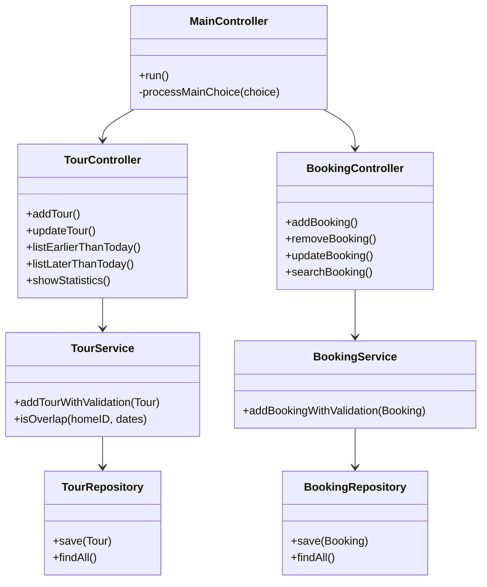

## 6. Biểu Đồ Hoạt Động UML (Mô Tả Văn Bản)

### 6.1 Tổng Quan Luồng Chương Trình

1.  **Bắt đầu**: Ứng dụng khởi tạo (`Main.main`).
2.  **Tải Dữ Liệu**: `MainController` chỉ thị Repositories tải dữ liệu từ các tệp văn bản (`init`).
3.  **Vòng Lặp Hiển Thị Menu**: View hiển thị 10 tùy chọn.
4.  **Định Tuyến theo Lựa Chọn**: Thu thập đầu vào từ người dùng. `Switch-Case` định tuyến thực thi đến chức năng cụ thể trong Sub-Controller.
5.  **Thực Thi & Quay Lại**: Chức năng thực thi; điều khiển quay lại vòng lặp menu chính.
6.  **Thoát và Lưu**: Nếu chọn "10", dữ liệu được lưu và chương trình chấm dứt.

### 6.2 Luồng Hoạt Động CHO TỪNG TÙY CHỌN MENU

Vui lòng tham khảo Phần 8 bên dưới để xem Biểu đồ Hoạt động chi tiết của TỪNG tùy chọn menu.

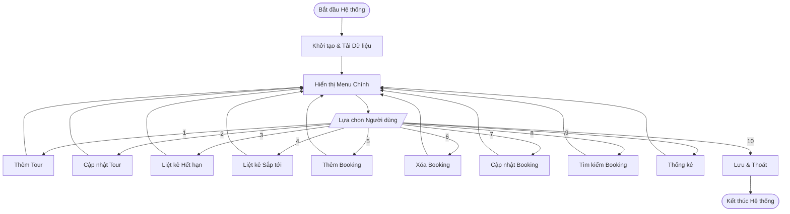

## 7. Biểu Đồ Luồng Dữ Liệu (Mô Tả Văn Bản)

### 7.1 DFD Cấp 0 (Biểu Đồ Bối Cảnh)

- **Thực Thể Ngoài**: `User` (Người dùng)
- **Hệ Thống**: `Hệ thống Đặt chỗ Homestay`
- **Kho Dữ Liệu**: `FileSystem` (Hệ thống Tệp)
- **Luồng**: Người dùng cung cấp đầu vào/lệnh; Hệ thống xác thực và cập nhật Tệp; Hệ thống cung cấp Báo cáo cho Người dùng.

### 7.2 DFD Cấp 1

1.  **Thêm Tour**: User -> `Chi tiết Tour` -> **Xử lý Thêm Tour** -> `Tour Hợp lệ` -> `Tours.txt`.
2.  **Cập nhật Tour**: User -> `ID & Cập nhật` -> **Xử lý Cập nhật Tour** -> `Tour Đã cập nhật` -> `Tours.txt`.
3.  **Liệt kê Hết hạn**: `Tours.txt` -> **Xử lý Lọc Hết hạn** -> `Danh sách Hết hạn` -> User.
4.  **Liệt kê Sắp tới**: `Tours.txt` -> **Xử lý Lọc & Sắp xếp** -> `Danh sách Sắp xếp` -> User.
5.  **Thêm Booking**: User -> `Chi tiết Booking` -> **Xử lý Thêm Booking** -> `Booking Hợp lệ` -> `Bookings.txt` (và Cập nhật `Tours.txt`).
6.  **Xóa Booking**: User -> `ID` -> **Xử lý Xóa Booking** -> Cập nhật `Bookings.txt`, Cập nhật `Tours.txt`.
7.  **Cập nhật Booking**: User -> `ID & Cập nhật` -> **Xử lý Cập nhật** -> `Bookings.txt`.
8.  **Tìm kiếm Booking**: User -> `Từ khóa Tên` -> **Xử lý Tìm kiếm** -> `Danh sách Kết quả` -> User.
9.  **Thống kê**: `Tours.txt` + `Homestays.txt` -> **Xử lý Tính toán** -> `Báo cáo` -> User.
10. **Thoát**: Bộ nhớ -> **Xử lý Lưu** -> `Tất cả Tệp`.

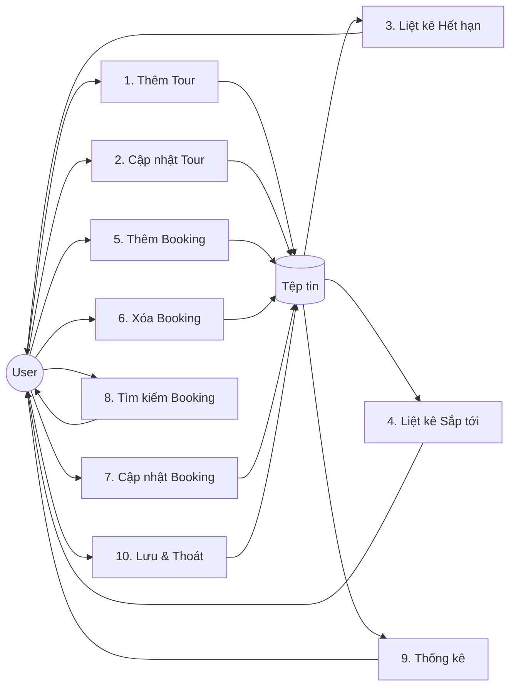

## 8. Luồng Chức Năng và Mã Giả

### 8.1 Thêm Tour mới (Add a new Tour)

**a. Luồng chức năng**

- **Đầu vào**: ID Tour, ID Homestay, Tên, Số ngày, Giá, Số khách, Ngày khởi hành, Ngày kết thúc.
- **Xác thực**: Tính duy nhất của ID, sự tồn tại của Homestay, kiểm tra Sức chứa, kiểm tra trùng lặp Ngày/Giờ.
- **Đầu ra**: Thông báo thành công hoặc chi tiết Lỗi.

**b. Biểu Đồ Hoạt Động UML**

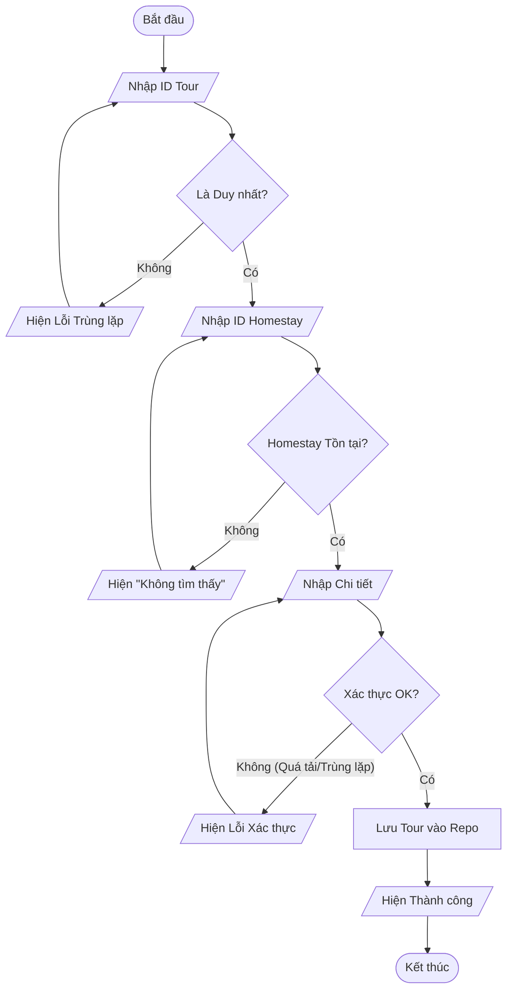

**c. Mã Giả**

```text
BEGIN
    LOOP
        DISPLAY "Nhập Tour ID"
        INPUT id
        IF tourRepo.findById(id) != NULL THEN
            DISPLAY "ID đã tồn tại"
            CONTINUE
        END IF
        BREAK
    END LOOP

    LOOP
        DISPLAY "Nhập Homestay ID"
        INPUT hID
        IF homestayRepo.findById(hID) == NULL THEN
            DISPLAY "Không tìm thấy Homestay"
            CONTINUE
        END IF
        BREAK
    END LOOP

    DISPLAY "Nhập Tên, Giá, Sức chứa, Ngày"
    INPUT data

    IF data.capacity > homestay.maxCapacity THEN
        DISPLAY "Lỗi: Quá sức chứa"
        RETURN
    END IF

    IF tourService.isOverlap(hID, data.dates) THEN
        DISPLAY "Lỗi: Xung đột ngày"
        RETURN
    END IF

    tour = NEW Tour(data)
    tourRepo.save(tour)
    DISPLAY "Thêm Tour Thành Công"
END
```

---

### 8.2 Cập nhật Tour theo ID (Update a Tour by ID)

**a. Luồng chức năng**

- **Đầu vào**: ID Tour để cập nhật.
- **Xác thực**: Tour tồn tại.
- **Quy trình**: Sửa đổi các trường cho phép (Giá, Ngày, v.v.). Xác thực lại trùng lặp nếu ngày thay đổi.
- **Đầu ra**: Bản ghi đã cập nhật.

**b. Biểu Đồ Hoạt Động UML**

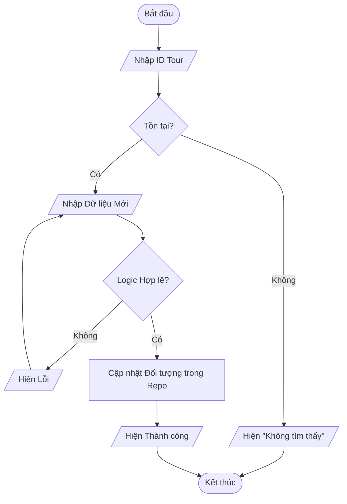

**c. Mã Giả**

```text
BEGIN
    DISPLAY "Nhập Tour ID"
    INPUT id
    tour = tourRepo.findById(id)

    IF tour == NULL THEN
        DISPLAY "Không tìm thấy Tour"
        RETURN
    END IF

    DISPLAY "Nhập Chi tiết Mới"
    INPUT newData

    VALIDATE newData (Quy tắc trùng lặp, sức chứa)
    IF invalid THEN
        DISPLAY "Cập nhật Thất bại: Dữ liệu không hợp lệ"
        RETURN
    END IF

    tour.updateAttributes(newData)
    DISPLAY "Cập nhật Thành công"
END
```

---

### 8.3 Liệt kê Tour (Khởi hành < Hôm nay)

**a. Luồng chức năng**

- **Đầu vào**: Không (Kích hoạt bởi menu).
- **Quy trình**: Lọc `DepartureDate < CurrentDate`.
- **Đầu ra**: Danh sách các tour đã hết hạn.

**b. Biểu Đồ Hoạt Động UML**

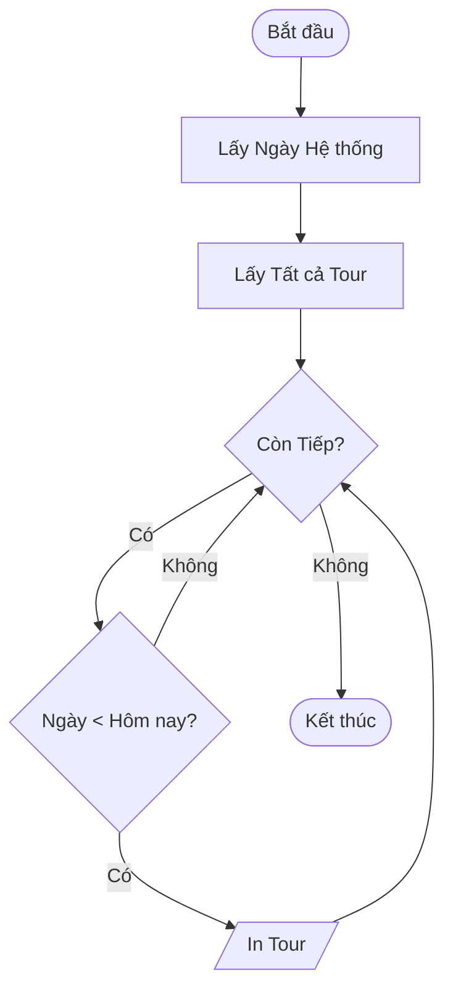

**c. Mã Giả**

```text
BEGIN
    today = GET_CURRENT_DATE()
    tours = tourRepo.findAll()

    DISPLAY "--- CÁC TOUR ĐÃ HẾT HẠN ---"
    FOR EACH t IN tours
        IF t.departureDate < today THEN
            DISPLAY t.toString()
        END IF
    END FOR
END
```

---

### 8.4 Liệt kê Tour (Khởi hành > Hôm nay) [Sắp xếp]

**a. Luồng chức năng**

- **Đầu vào**: Không.
- **Quy trình**: Lọc `DepartureDate > CurrentDate`. Sắp xếp theo `(Price * Tourists)` giảm dần.
- **Đầu ra**: Bảng đã sắp xếp.

**b. Biểu Đồ Hoạt Động UML**

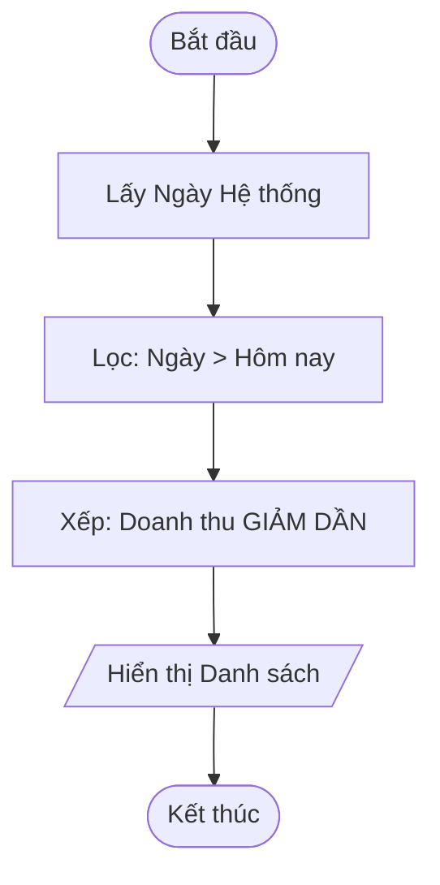

**c. Mã Giả**

```text
BEGIN
    today = GET_CURRENT_DATE()
    upcomingList = []

    FOR EACH t IN tourRepo.findAll()
        IF t.departureDate > today THEN
            upcomingList.add(t)
        END IF
    END FOR

    SORT upcomingList BY (t.price * t.numberTourist) DESCENDING

    FOR EACH t IN upcomingList
        DISPLAY t.toString()
    END FOR
END
```

---

### 8.5 Thêm Đặt chỗ mới (Add a new Booking)

**a. Luồng chức năng**

- **Đầu vào**: Chi tiết Booking, ID Tour.
- **Xác thực**: Tour tồn tại, Tour khả dụng (`!isBooked`), Logic ngày tháng.
- **Đầu ra**: Booking mới, Tour được cập nhật thành `Booked` (Đã đặt).

**b. Biểu Đồ Hoạt Động UML**

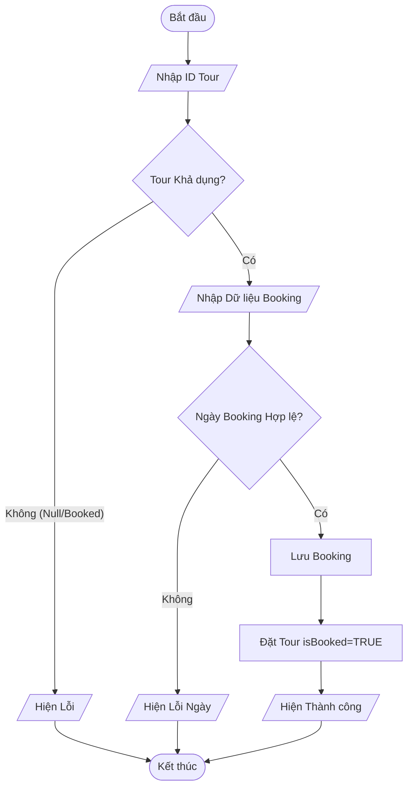

**c. Mã Giả**

```text
BEGIN
    DISPLAY "Nhập ID Tour"
    INPUT tid
    tour = tourRepo.findById(tid)

    IF tour == NULL OR tour.isBooked == TRUE THEN
        DISPLAY "Tour không khả dụng"
        RETURN
    END IF

    DISPLAY "Nhập Tên Khách, SĐT, Ngày"
    INPUT bData

    IF bData.date >= tour.departureDate THEN
        DISPLAY "Ngày Booking không hợp lệ"
        RETURN
    END IF

    booking = NEW Booking(bData, tid)
    bookingRepo.save(booking)
    tour.setIsBooked(TRUE)
    DISPLAY "Đặt Tour Thành công"
END
```

---

### 8.6 Xóa Đặt chỗ theo ID (Remove a Booking by ID)

**a. Luồng chức năng**

- **Đầu vào**: ID Booking.
- **Quy trình**: Tìm booking -> Tìm Tour liên kết -> Giải phóng Tour -> Xóa Booking.
- **Đầu ra**: Thông báo thành công.

**b. Biểu Đồ Hoạt Động UML**

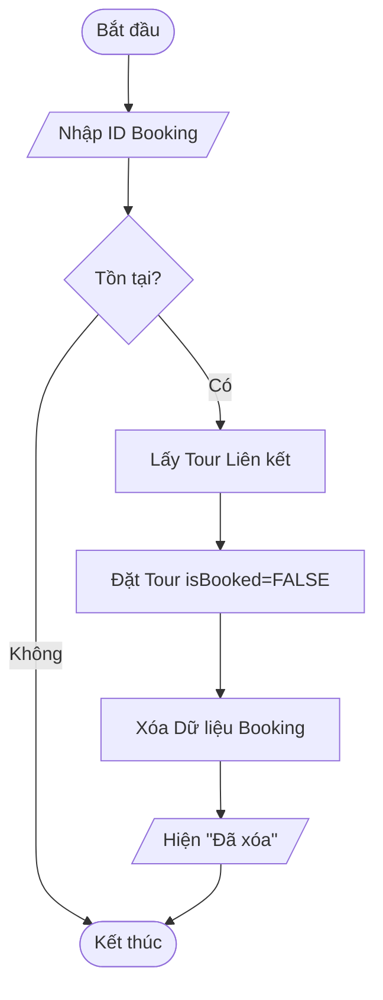

**c. Mã Giả**

```text
BEGIN
    DISPLAY "Nhập Booking ID"
    INPUT bid
    booking = bookingRepo.findById(bid)

    IF booking == NULL THEN RETURN END IF

    tour = tourRepo.findById(booking.tourID)
    IF tour != NULL THEN
        tour.setIsBooked(FALSE)
    END IF

    bookingRepo.delete(bid)
    DISPLAY "Đã xóa Booking"
END
```

---

### 8.7 Cập nhật Đặt chỗ theo ID (Update a Booking by ID)

**a. Luồng chức năng**

- **Đầu vào**: ID Booking, giá trị mới.
- **Xác thực**: Áp dụng quy tắc xác thực (Độ dài tên khách, Định dạng SĐT).
- **Đầu ra**: Booking đã cập nhật.

**b. Biểu Đồ Hoạt Động UML**

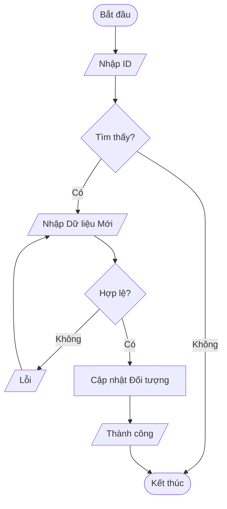

**c. Mã Giả**

```text
BEGIN
    DISPLAY "Nhập Booking ID"
    INPUT bid
    booking = bookingRepo.findById(bid)

    IF booking != NULL THEN
        DISPLAY "Nhập Tên Mới, SĐT Mới"
        INPUT newData
        VALIDATE newData
        booking.update(newData)
        DISPLAY "Đã cập nhật"
    END IF
END
```

---

### 8.8 Tìm kiếm Đặt chỗ theo tên khách (Search Booking)

**a. Luồng chức năng**

- **Đầu vào**: Tên Khách (Từ khóa).
- **Quy trình**: Tìm kiếm tuyến tính hoặc Lọc Stream.
- **Đầu ra**: Danh sách các booking phù hợp.

**b. Biểu Đồ Hoạt Động UML**

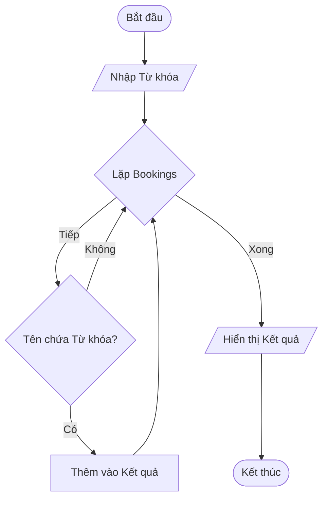

**c. Mã Giả**

```text
BEGIN
    DISPLAY "Nhập Tên Khách"
    INPUT keyword
    found = FALSE

    FOR EACH b IN bookingRepo.findAll()
        IF b.fullName CONTAINS keyword THEN
            DISPLAY b
            found = TRUE
        END IF
    END FOR

    IF NOT found THEN DISPLAY "Không có kết quả" END IF
END
```

---

### 8.9 Thống kê (Tourists per Homestay)

**a. Luồng chức năng**

- **Đầu vào**: Không.
- **Quy trình**: Tổng hợp Số lượng khách Nhóm theo Homestay.
- **Đầu ra**: Báo cáo.

**b. Biểu Đồ Hoạt Động UML**

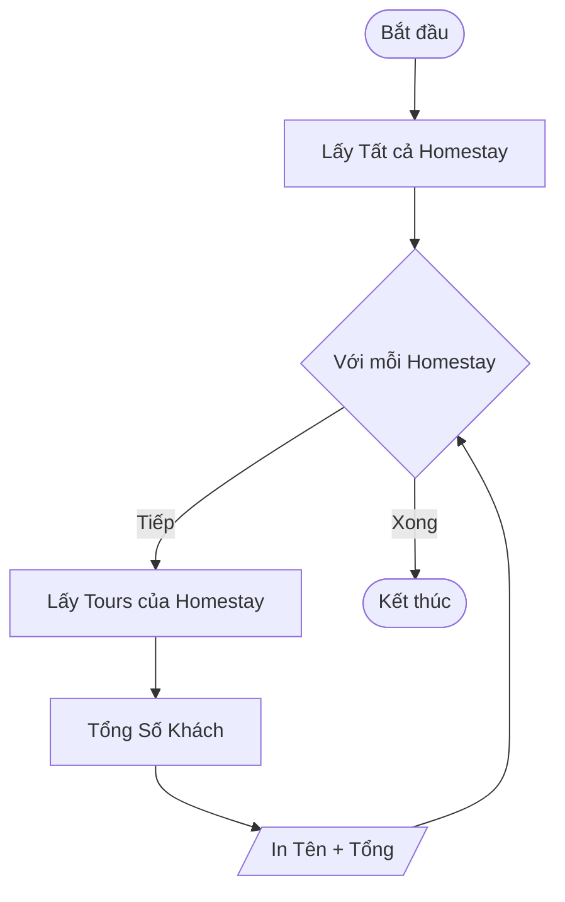

**c. Mã Giả**

```text
BEGIN
    homestays = homestayRepo.findAll()
    FOR EACH h IN homestays
        sum = 0
        tours = tourRepo.findByHomestayID(h.ID)
        FOR EACH t IN tours
            sum = sum + t.numberTourist
        END FOR
        DISPLAY h.HomeName, sum
    END FOR
END
```

---

### 8.10 Thoát (Quit)

**a. Luồng chức năng**

- **Đầu vào**: Lệnh Thoát.
- **Quy trình**: Ghi Tệp.
- **Đầu ra**: Chấm dứt.

**b. Biểu Đồ Hoạt Động UML**

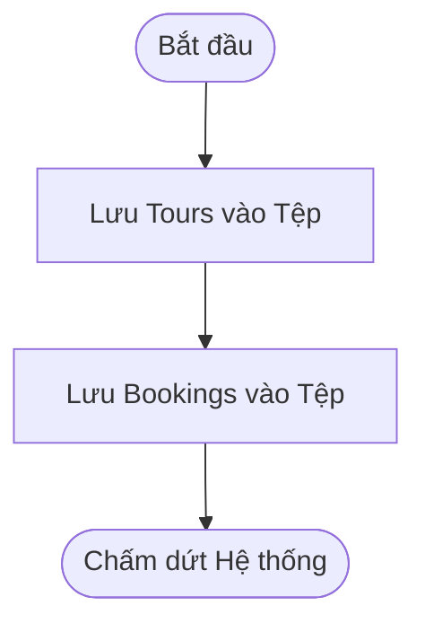

**c. Mã Giả**

```text
BEGIN
    DISPLAY "Đang lưu Dữ liệu..."
    CALL tourRepo.saveAll("Tours.txt")
    CALL bookingRepo.saveAll("Bookings.txt")
    DISPLAY "Tạm biệt"
    EXIT(0)
END
```

---

## 9. Xác Thực và Quy Tắc Nghiệp Vụ

### 9.1 Quy Tắc Toàn Vẹn Dữ Liệu

1.  **Sự Tồn Tại của Homestay**:
    - _Quy tắc_: Một Tour BẮT BUỘC phải được liên kết với một ID Homestay hợp lệ.
    - _Thực hiện_: `homestayRepository.findById(homeID)` không được trả về null.
2.  **Định Danh Duy Nhất (Khóa Chính)**:
    - _Quy tắc_: `TourID` và `BookingID` phải là duy nhất trên toàn bộ hệ thống.
    - _Thực hiện_: Trước khi lưu, hệ thống kiểm tra `repository.findById(newID)` và từ chối nếu trùng lặp.

### 9.2 Quy Tắc Nghiệp Vụ Tour

1.  **Ràng Buộc Sức Chứa**:
    - _Quy tắc_: Số lượng khách du lịch trong một tour không được vượt quá sức chứa vật lý của Homestay.
    - _Logic_: `Tour.touristCount <= Homestay.maximumCapacity`.
2.  **Tính Nhất Quán Ngày Tháng**:
    - _Quy tắc_: Ngày Khởi hành của tour phải thực sự trước Ngày Kết thúc.
    - _Logic_: `DepartureDate < EndDate`.
3.  **Lịch Trình Không Chồng Chéo**:
    - _Quy tắc_: Một Homestay không thể tổ chức hai tour cùng một lúc.
    - _Logic_: Đối với bất kỳ hai tour T1 và T2 tại cùng một Homestay:
      - Trùng lặp xảy ra nếu `(T1.Start <= T2.End) VÀ (T2.Start <= T1.End)`.
      - Hệ thống từ chối bất kỳ tour mới nào thỏa mãn điều kiện này với một tour hiện có.

### 9.3 Quy Tắc Nghiệp Vụ Booking

1.  **Tính Khả Dụng Của Tour**:
    - _Quy tắc_: Chỉ có thể đặt tour cho một Tour CHƯA được đặt.
    - _Logic_: Kiểm tra `Tour.isBooked()`. Nếu `true`, từ chối.
2.  **Thời Gian Đặt Chỗ**:
    - _Quy tắc_: Việc đặt chỗ phải được thực hiện _trước khi_ tour khởi hành.
    - _Logic_: `BookingDate` phải thực sự trước `Tour.DepartureDate`.
3.  **Chính Sách Một Tour - Một Booking**:
    - _Quy tắc_: Trong phạm vi hệ thống cụ thể này, một Tour chỉ chấp nhận chính xác MỘT giao dịch đặt chỗ chính.
    - _Thực hiện_: Sau khi đặt chỗ thành công, hệ thống đặt trạng thái của Tour thành `Booked` (Khóa tour).
    - _Đảo ngược_: Nếu một booking bị xóa, trạng thái của Tour được đặt lại thành `Available` (Khả dụng).

## 10. Quyết Định Thiết Kế và Đánh Đổi

- **Kiến Trúc (MVC)**:
  - _Quyết định_: Tách biệt Logic (Service), Dữ liệu (Repo), và Giao diện (View).
  - _Đánh đổi_: Nhiều tệp/lớp hơn so với ứng dụng "God Class" đơn giản, tăng độ phức tạp cho các ứng dụng nhỏ nhưng đảm bảo khả năng mở rộng.
- **Sự Bền Vững (Tệp)**:
  - _Quyết định_: Sử dụng tệp `.txt` (CSV).
  - _Đánh đổi_: Đơn giản và tính di động (không cần máy chủ DB) so với Hiệu suất (chậm hơn với tập dữ liệu lớn).
- **Mẫu Thiết Kế**:
  - _Quyết định_: Sử dụng **Lớp Dịch Vụ** để xác thực.
  - _Đánh đổi_: Thêm lớp trừu tượng, nhưng tập trung các quy tắc nghiệp vụ (nguyên tắc DRY).

## 11. Kết Luận

**Hệ Thống Quản Lý Đặt Chỗ Homestay** là một ứng dụng bảng điều khiển được thiết kế toàn diện, tuân thủ nghiêm ngặt các tiêu chuẩn Lập trình Hướng Đối tượng. Bằng cách triển khai kiến trúc phân lớp, thực thi các quy tắc xác thực mạnh mẽ và sử dụng các mẫu thiết kế rõ ràng, hệ thống đáp ứng tất cả các yêu cầu chức năng về quản lý Tour và Đặt chỗ. Tài liệu được cung cấp ở đây xác nhận logic và cấu trúc của hệ thống, làm cho nó phù hợp để đánh giá học thuật và khả năng mở rộng trong tương lai.
